# **🛠️ CS6263 - Blog for "Copiloting the Copilots: Fusing Large Language Models with Completion Engines for Automated Program Repair"**
**Authors: Yuxiang Wei, Chunqiu Steven Xia, Lingming Zhang (Urbana-Champaign, USA)**

**Published: 30 November 2023**

## **Introduction to Automated Program Repair**
<p align="justify">
Automated program repair helps developers to improve software reliability by creating automated patches to buggy code. The importance of creating automated tools is that the manual labor that developers often need to invest in fixing a bug is decreased. The usual chain of work for fixing a bug is first they need to debug the code to find which parts of the code are contributing to the bug,which sometimes can be an exhaustive task as many software projects are formed of hundreds of dependencies and third-party libraries in which the code implementation might be difficult to find or even not available. Secondly, they will need to implement the fix to the code and lastly, the code needs to pass several testing phases to ensure is correct functionality. Hence, software faults not only decrease the reliability of the product but also most of the time, cause financial losses for developers and companies.
</p>
<p align="justify">
In this blog, we will explore and familiarize ourselves with the APR tool presented in the paper "Copiloting the Copilots: Fusing Large Language Models with Completion Engines for Automated Program Repair". 

🛠️ The authors of the paper made their code available, so we will run, test, and analyze their Repilot tool, an automated patch generation tool that leverages generative models to auto-regressively generate entire patched versions of code by using abstract syntax-based analysis (completion engines) to guide the code generation.

⚙️ Our objective is to gain knowledge of the novel approach presented in their research paper and dive into every step of their tool,running some testing, and analyze the results obtained.  
</p>

## **Motivation**
<p align="justify">
Recent investigations have demonstrated that Large Language Models(LLMs) have good capabilities for natural language tasks and also for coding tasks such as code generation, code infilling, and acting as copilots in software development.
</p>
<p align="center">
    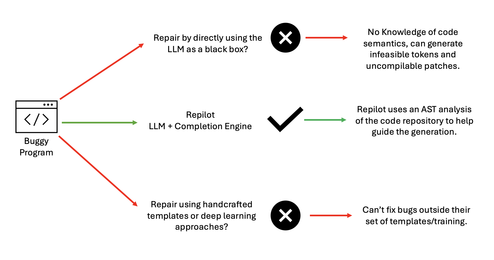
</p>
<p align="justify">
Also, LLMs have a very distinct form of generating tokens from Completion Engines. LLMs based on decoder architectures, will output a probability map for each possible next token. Then, it will do a probability-based sampling to select the next token. As this approach can look straightforward, there are still some issues with using LLMs directly, such as: LLMs can generate infeasible tokens, it is also hard for LLMs to generate identifier names such as those using camel case or underscores in their names, as they break the words into subwords and the probability of generating the complete identifier correctly is minimal, and at last, LLMs don't know the return types or member fields of the objects which can generate many uncompilable patches. 
</p>

## **System Design**
### **Completion Engine**
<p align="justify">
The Completion engine used in Repliot is the Java Completion Engine based on the Eclipse JDT Language Server. The Completion Engine has access to the project repository and dependencies, which help the LLM write partial code that is valid.
</p>

### **Models Used**
<p align="justify">
The framework was tested with two LLMs, CodeT5-large (770 million param, encoder-decoder model) and InCoder-6.7B (6.7 billion param, decoder only model)
</p>

### **Architecture Understanding**
<p align="justify">

We will explain the architecture in the Figure below by going thru the workflow of Repilot tool. 
<ul>
 <li>1.The flow starts by receiving the current code as input to the LLM which will output a probability map(search space) for the selection of the next token.</li>
<li>2. When a token is sampled from the search space, it will first check the Memorization module which stores tokens that are known to be feasible or not. The memorization module will get updated every time a token is accepted or rejected.</li>
<li>3. If a token is infeasible from the memorization module, its token probabilities for that token are changed to zeros. If accepted then token selection finishes.</li>
<li>4. If a token is not in the memorization module, then the completion engine will filter out the tokens that can never lead to a valid patch code. This is accomplished by adding the given token to the current program and calling the CE “complete” function. </li>
<ul>
                <li>a. If the complete function result is not unknown and there are no completion options, then it means the token is infeasible. If the token is rejected, then Repilot will zero the token probabilities and will keep searching the search space until a token is accepted. </li>
                <li>b.If the token is accepted, then the selection process ends.</li>
            </ul>
<li>5. The active completion module will decrease the work of LLMs as long as the completion engine only has one possible suggestion, we don’t need to call the LLMs, the completion engine already offers the only feasible way to continue the generation.</li>
<li>6. The loop stops until the model generates the special end token.</li>
</ul>

<p align="center">
    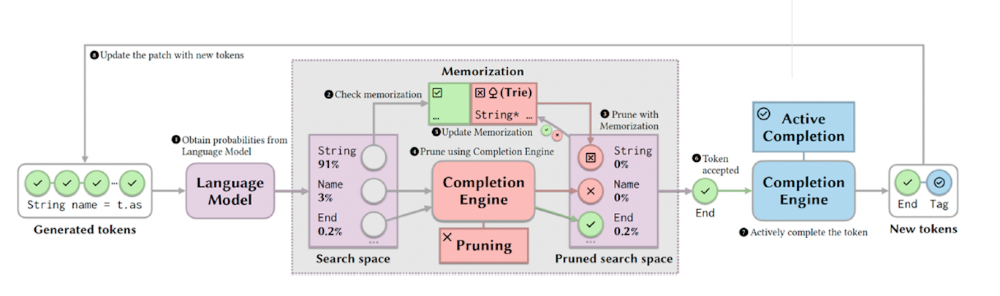
    <p align="center">Figure retrieved from Repilot paper[1].</p>
</p>

</p>

## **Running Repilot**
<p align="justify">
For easier implementation, authors suggest to run repilot as a docker image. So, first we will show how we follow the steps to run Repilot.
</p>

## **Running Repliot**
1. **Note:** First we make sure to have Docker installed on your system.
2. **Download Repliot Image** By downloading the image you will have a running environment with Repilots APR tool and its Completion Engine. 
```
    docker pull universefly/repilot:fse23
```
3. **Run Image** 
```
#First
docker run -it --name repilot universefly repilot:fse23
#Enter root directory
cd /root/Repilot
```

## **Testing**
1. **Generating patches for the project Chart-9** 
<p align="justify">
We will call the main function and pass the following arguments: "repair" to indicate we are generating patches, the project name, and the number of patches to generate. We limit the number of patches to 5, due to time and computational constraints, given is very time and computationally costly to generate a large number of patches which can take days or weeks. 
</p>

- Project name: "Chart-9" 
- Repair command: repair
- Model used: Codet5 
- Patches Number: 5
- Saving folder: chart-9-repilot66

```
ACTIVE=1 python -m repilot.cli.main repair -b "Chart-9" --method pruned-mem -d chart-9-repilot66 -n 5
```
Output: 
<p align="center">
    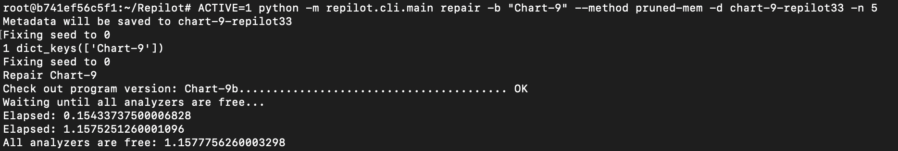
</p>
2. First, we can see the buggy source code and the line in which the bug is located: 
<p align="center">
    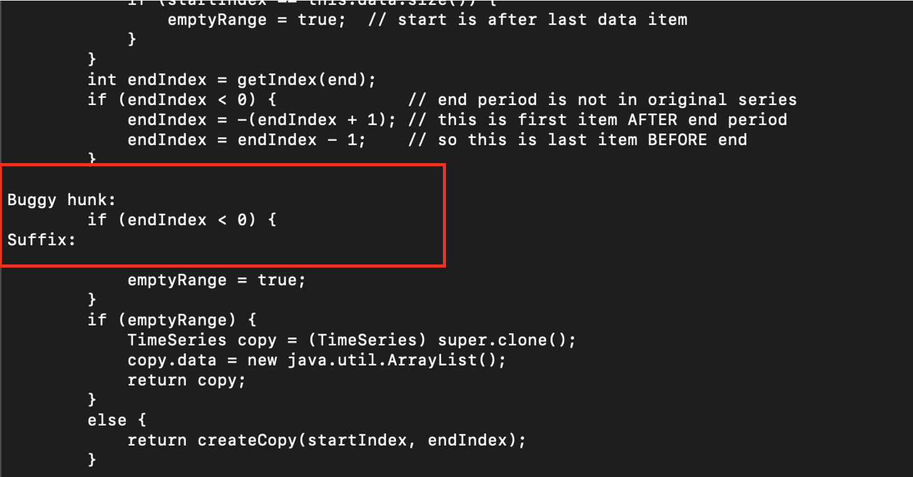
</p>
3. Then we will see the generation process for each candidate patch, and their accepted/rejected tokens. 

<ul>
 <li> ⚪ White Boxes: are the accepted tokens for each next generation. </li>
<li>🔺 Red Box: The Accepted and complete patch 1. </li>
 <li>👾Purple Box: Time it takes to generate the patch. </li>
</ul>
Patch 1: 
<p align="center">
    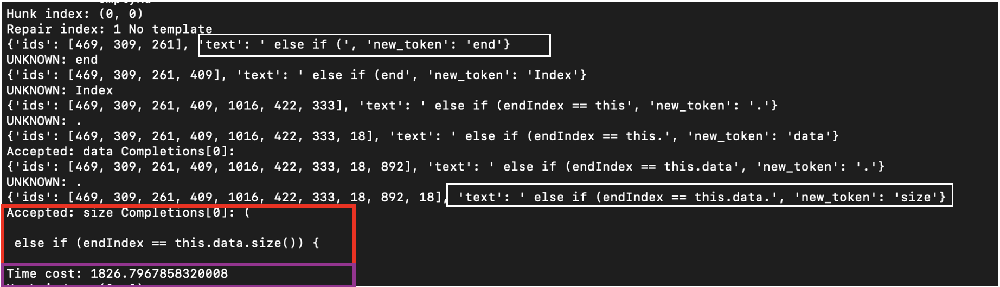
</p>
Patch 2: 
<p align="center">
    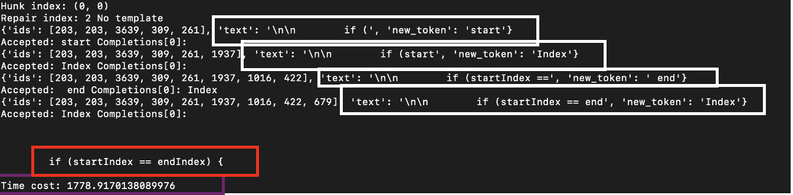
</p>
Patch 3: 
<p align="center">
    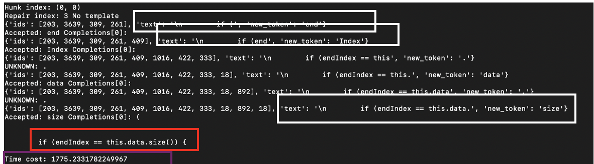
</p>
Patch 4:
<p align="center">
    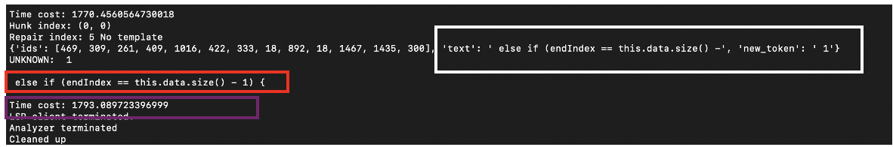
</p>

2. **Validate the generated patches** 

Now, run the validate function from the main source file. It will validate that all generated patches are compilable patches. 

- Repair command: validate
- Saving folder: chart-9-repilot66
```
 python -m repilot.cli.main validate -d chart-9-repilot66
 ```

 Results: 
<p align="center">
    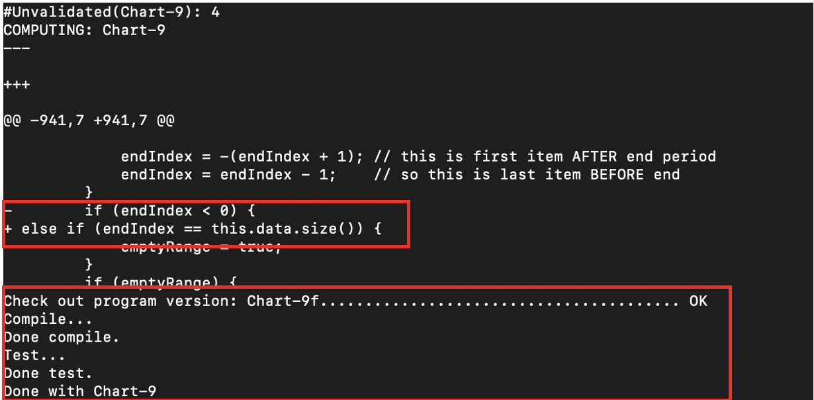
</p>
<p align="center">
    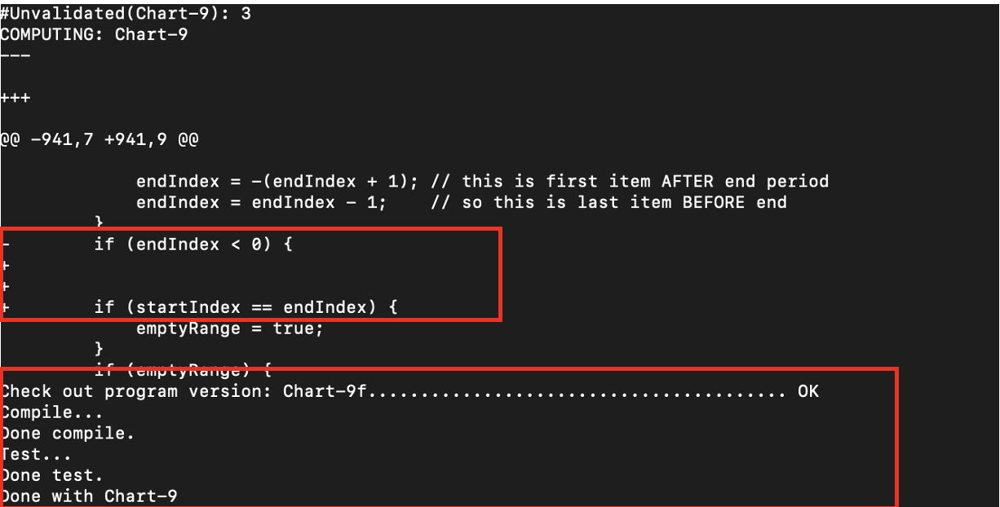
</p>
<p align="center">
    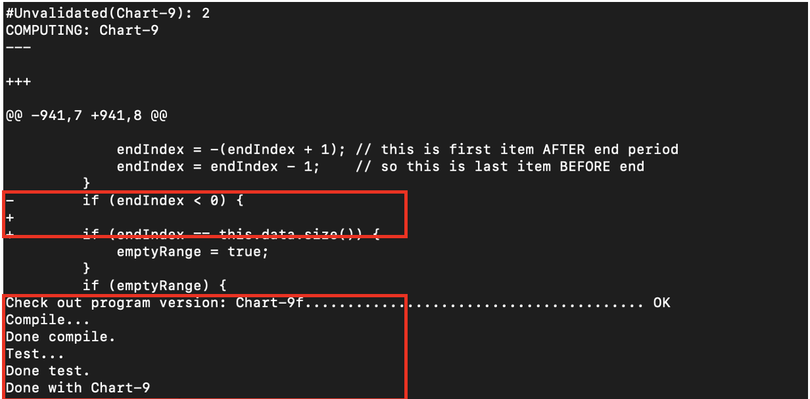
</p>
<p align="center">
    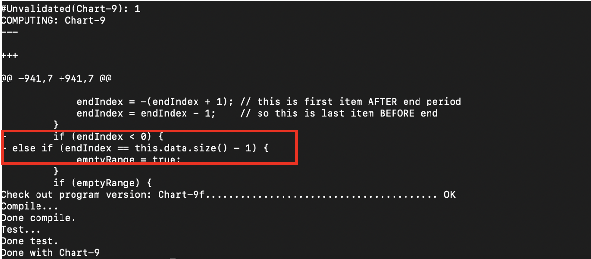
</p>


## **Tables**

Let's display the evaluation for the patches we just generated. Which means that all created patches were able to compile and pass the test suit validation. 

```
python -m repilot.cli.main evaluate -d chart-9-repilot66
```
<p align="center">
    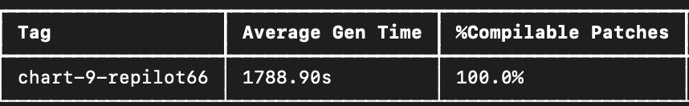
</p>

## **Experiments and Results**
<p align="justify">
For evaluation, first, Repilot will generate a set of candidate patches, and then it will validate each of the patches against the test suite provided by the dataset. All patches that pass the test suites are what we call plausible patches.  However, not all plausible patches fit the user's purpose. So, additional human inspection is required to get the actual correct patches. 

When compared with existing techniques from various methodologies, including deep learning and template-based approaches, Repilot generates the most number of correct fixes on Defects4J and generalizes better to unseen bugs by fixing more unique bugs than no other approach was able to fix.
</p>
<p align="center">
    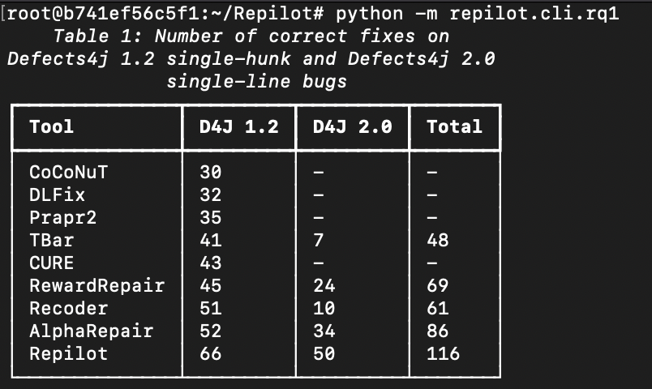
</p>

## **Dataset**
<p align="justify">
The benchmark datasets employed on APR tasks consist of Defects4J 1.2, featuring single hunk bugs, and Defects4J 2.0, characterized by single line bugs. These datasets are manually curated Java datasets containing pairs of buggy and patched versions of source projects, complemented by test suites for validation. The dataset comes from several open source repositories from Java programs such as, commons-cli, jfreechart, commons-math,etc. 
</p>

 **1. Dataset Installation**
<p align="justify">
We followed the steps given under the repository for dataset Defects4J. [Defects4J Github](https://github.com/rjust/defects4j)

- Then, to verify the correct installation, run below command: 
```
# Add defects environmental variable to your path. 
# path2defects4j: replace it for your local path where defects is located. 
export PATH=$PATH:"path2defects4j"/framework/bin

# Run below command to get more detail information about the project Chart on the defects dataset. 
defects4j info -p Chart 
```
Output: 
It will give you more detail information about the open-source repository from which these bugs were collected. 
<ul>
 <li> 🔵 Project Name: jfreechart </li>
<li> 🔵 Number of bugs: 26  </li>
</ul>

<p align="center">
    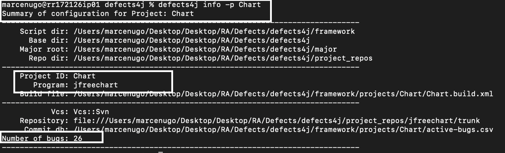
</p>

Now, to get more information about the bug we are generating patches for, we can run the command and pass the argument "b" with the id of the bug. 
```
defects4j info -p Chart -b 9
```

Output gives you information below: 

<ul>
 <li> 🔵 Oficial Bug Report URL </li>
<li> 🔵 Root Cause of bug  </li>
<li> 🔵 Files involved in the bug </li>
</ul>

<p align="center">
    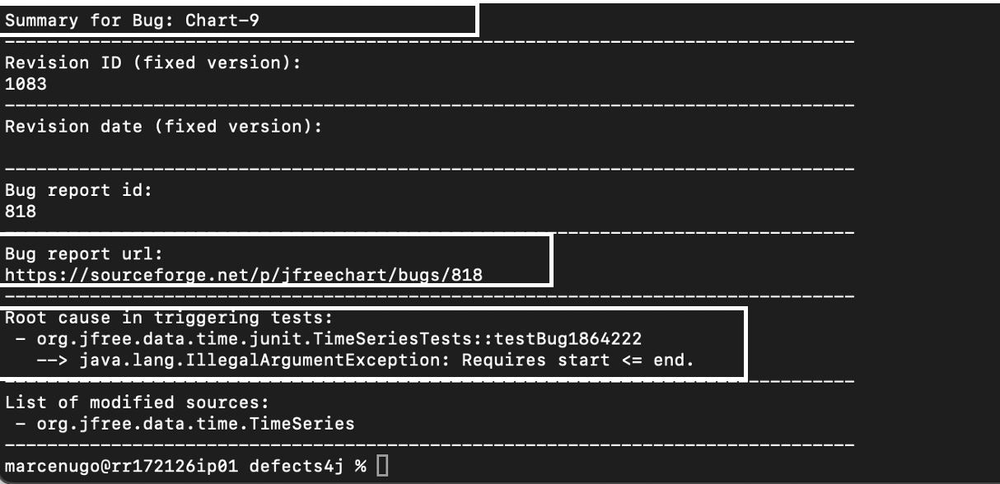
</p>

</p>

## **Conclusion**
<p align="justify">
This blog intends to have a better understanding of new tools integrating LLMs for automated code repair.  Repilot paper is very innovative, and we believe that exploring the use of LLMs alongside traditional software engineering concepts is an area that can bring many benefits. Repilot offers a versatility approach and would be interesting to prove its utility across various programming languages such as Python which is a dynamic type language, different from Java being a statically data-typed language that needs explicit declaration of variable datatypes. Contrarily, dynamic type languages, where datatype declaration is unnecessary, could potentially pose challenges for Repilot’s completion engine. Additionally, exploring Repilot’s performance under multi-chunk code bugs, where dependencies are more complex would be interesting.
</p>

## Special Thanks

To the authors of Repilot: [Repilot](https://github.com/ise-uiuc/Repilot)

## **References**

Wei, Y., Xia, C. S., & Zhang, L. (2023, November). Copiloting the copilots: Fusing large language models with completion engines for automated program repair. In Proceedings of the 31st ACM Joint European Software Engineering Conference and Symposium on the Foundations of Software Engineering (pp. 172-184).

René Just, Darioush Jalali, and Michael D. Ernst. 2014. Defects4J: a database of existing faults to enable controlled testing studies for Java programs. In Proceedings of the 2014 International Symposium on Software Testing and Analysis (ISSTA 2014). Association for Computing Machinery, New York, NY, USA, 437–440. https://doi.org/10.1145/2610384.2628055

#### ***Original authors Repository [project page](https://github.com/ise-uiuc/Repilot).***
---
